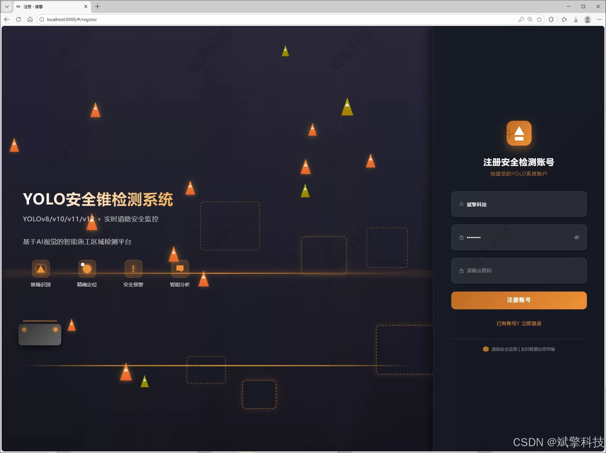
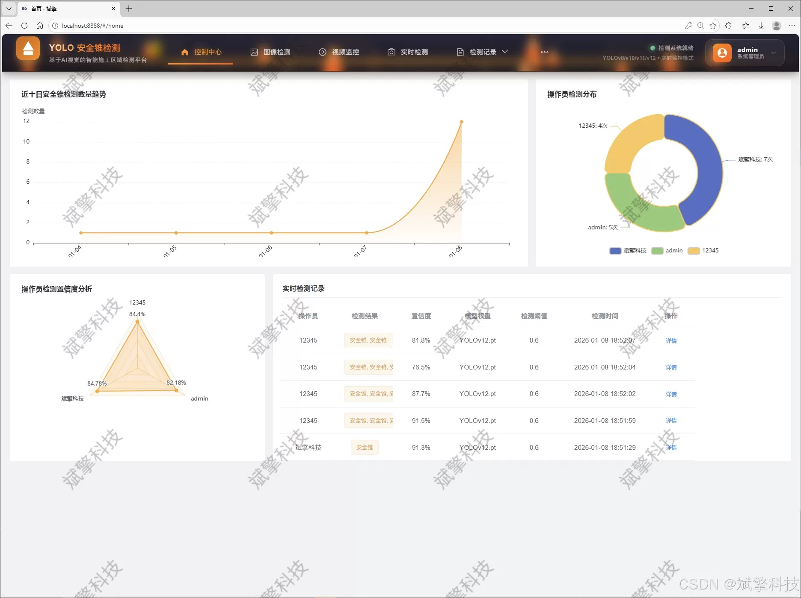
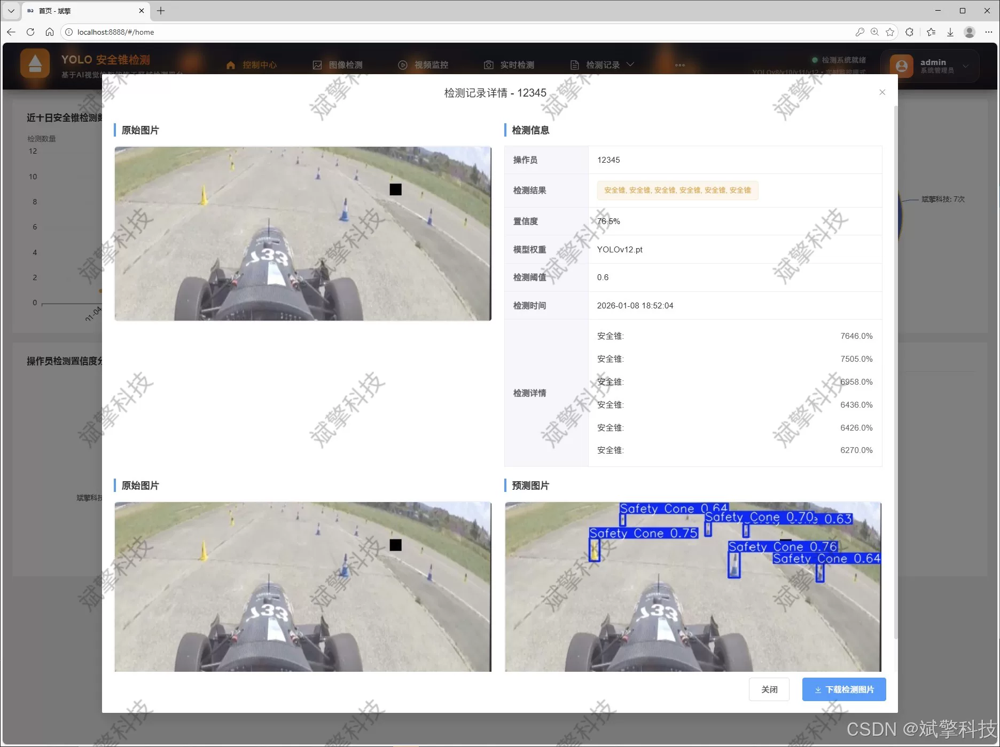
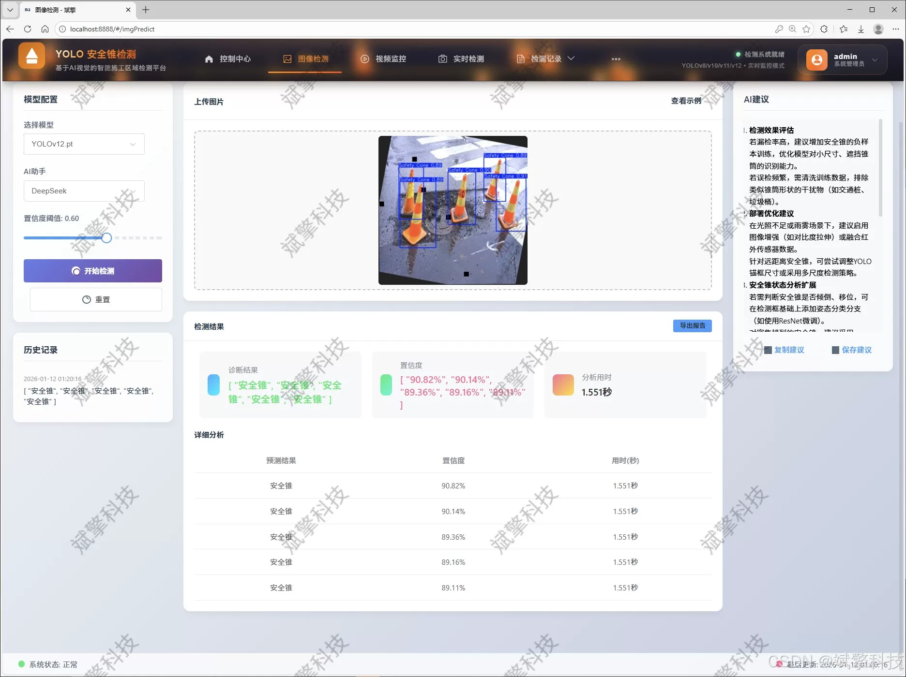
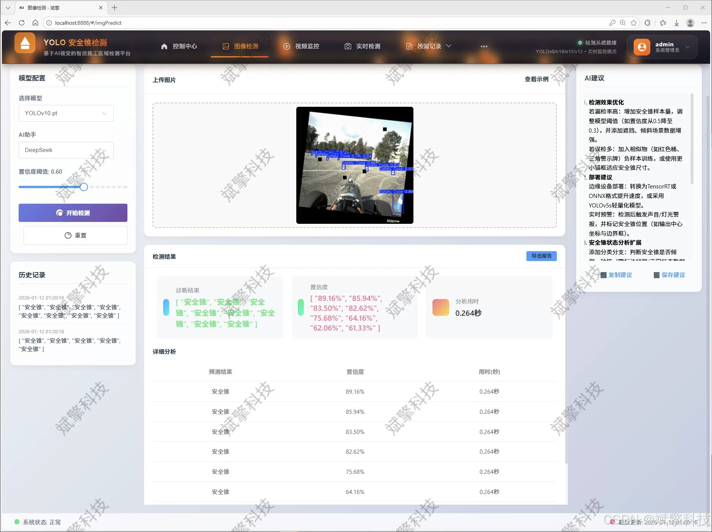
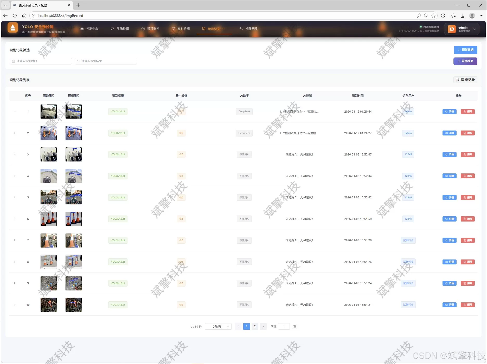
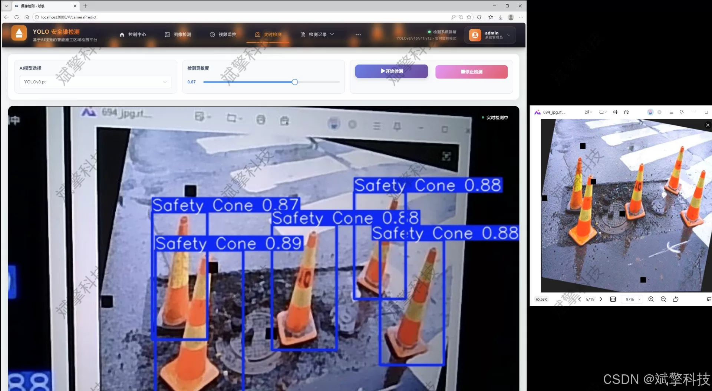
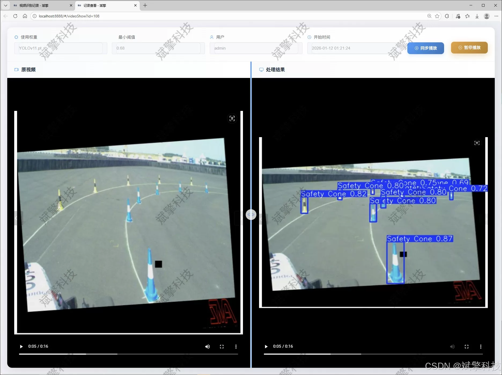
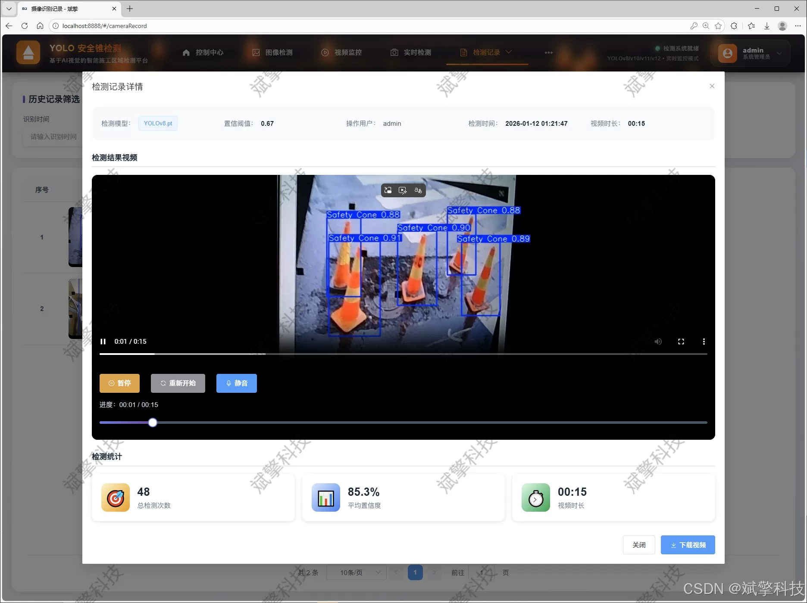

# YOLO safety cone detection system

## Body

The YOLO safety cone detection system is based on the YOLO deep learning and the big models of Qianwen and DeepSeek. The system includes the DeepSeek intelligent analysis, web interaction interface, front-end and back-end separation, YOLO data, and YOLOv8/YOLOv10/YOLOv11/YOLOv12.

The core detection module of this system adopts the latest version of the YOLO series algorithm (YOLOv8, YOLOv10, YOLOv11, and YOLOv12), constructing a high-quality, targeted safety cone dataset with 5960 training images, 341 validation images, and 170 test images. The model training and optimization have been completed. Through comparative experiments, the system allows users to flexibly switch between different versions of the YOLO model according to the actual scene's requirements for accuracy and speed, achieving dynamic adaptability in detection performance. In addition, the system innovatively integrates the intelligent analysis function of the DeepSeek large language model, which can understand the context of the detection results and describe them in terms of semantics, generating more rich and insightful analysis reports.

In terms of the engineering architecture, the system adopts a front-end and back-end separation design pattern. The backend is built on the SpringBoot framework, providing stable and efficient RESTful API services, and utilizes MySQL database for the persistent storage and management of structured data such as user information and detection records. The front end uses modern web technologies to build an interactive user interface. The system has comprehensive functions, covering user login registration, multimodal detection (supporting image, video file and real-time camera stream detection), comprehensive record management (image, video, camera recording in separate modules), multidimensional data visualization, user management module (administrators can perform add, delete, update, and query operations), and personal center (supports personal information, profile picture, password change) and other core functions.

Practical application shows that the system can not only realize high precision and efficiency of safety cone automatic detection and alarm, but also its scalable architecture design and rich interaction functions provide a reliable, easy to use and powerful comprehensive solution for intelligent transportation, construction site safety management and other fields.

Functional module

✅ User Login and Registration: Supports password detection, saves to MySQL database.

✅ Supports four YOLO model switches, YOLOv8, YOLOv10, YOLOv11, YOLOv12.

✅ Information Visualization, Data Visualization.

✅ Image detection supports AI analysis functions, deepseek and Qianwen.

✅ Supports image detection, video detection, and real-time camera detection. The results are saved to a MySQL database.

✅ Picture recognition record management, video recognition record management and camera recognition record management.

✅ User Management Module, administrators can add, delete, modify, and query users.

✅ Personal center, can modify their own information, password name profile picture and so on.

There is no Lunwen writing service, nor any Lunwen.

## Images

## Payment

Here is a pay link on Stripe ( https://buy.stripe.com/3cs8yP7sY87d0vu9AB ). Please contact me lonlonago@foxmail.com after funding $89, and I will send you a complete data files , thank you!

